<!-- LOCAL CITY-POP BANNER -->

 

> **Versión inicial:** tecnologías y gráficos de la referencia como muestra visual; pendientes de personalizar.

---

## `$ whoami`

  

 

## `$ cat tech-stack.yaml`

<table border="1" cellpadding="14" bgcolor="#0b1220">
  <thead>
    <tr>
      <th colspan="2" align="left"><code>Andy-CE17:~$ cat tech-stack.yaml</code></th>
    </tr>
  </thead>
  <tbody>
    <tr>
      <td width="50%" valign="top"><code>├─ ☁ cloud_infrastructure:</code>  
         
        <code>AWS · Azure · Ansible</code>
      </td>
      <td width="50%" valign="top"><code>├─ ▣ databases_messaging:</code>  
        
         
        <code>Amazon RDS · MySQL · PostgreSQL · MongoDB · DynamoDB</code>
      </td>
    </tr>
    <tr>
      <td valign="top"><code>├─ ⚙ containers_ci_cd:</code>  
         
        <code>Kubernetes · Docker · GitHub Actions · GitLab CI · Bitbucket · Bash</code>
      </td>
      <td valign="top"><code>├─ ◉ monitoring_observability:</code>  
        
        
         
        <code>Sentry · Prometheus · Datadog · Amazon CloudWatch</code>
      </td>
    </tr>
    <tr>
      <td valign="top"><code>├─ ✦ languages_frameworks:</code>  
         
        <code>Node.js · JavaScript · React · Next.js · TypeScript · Python · FastAPI</code>
      </td>
      <td valign="top"><code>╰─ ⌁ security_iac:</code>  
        
        
        
        
         
        <code>Trivy · SonarQube · Terraform · Cilium · Falco</code>
      </td>
    </tr>
  </tbody>
  <tfoot>
    <tr>
      <td colspan="2"><code>status: ready&nbsp;&nbsp;·&nbsp;&nbsp;environment: production</code></td>
    </tr>
  </tfoot>
</table>

---

## `$ kubectl get signals --all-namespaces`

  <picture>
    <source media="(prefers-color-scheme: dark)" srcset="radar-dark.svg">
    <source media="(prefers-color-scheme: light)" srcset="radar-light.svg">
    
  </picture>&nbsp;
  <picture>
    <source media="(prefers-color-scheme: dark)" srcset="radar-langs-dark.svg">
    <source media="(prefers-color-scheme: light)" srcset="radar-langs-light.svg">
    
  </picture>

<code>signals: devops_skill_radar · language_stack_radar · status: healthy</code>

---

## `$ connect --socials`

  
Andy-CE17 · Código, proyectos y tecnología
 Diseño basado en <a href="https://github.com/macu-dev/macu-dev">macu-dev</a>, adaptado en azul y cian.

