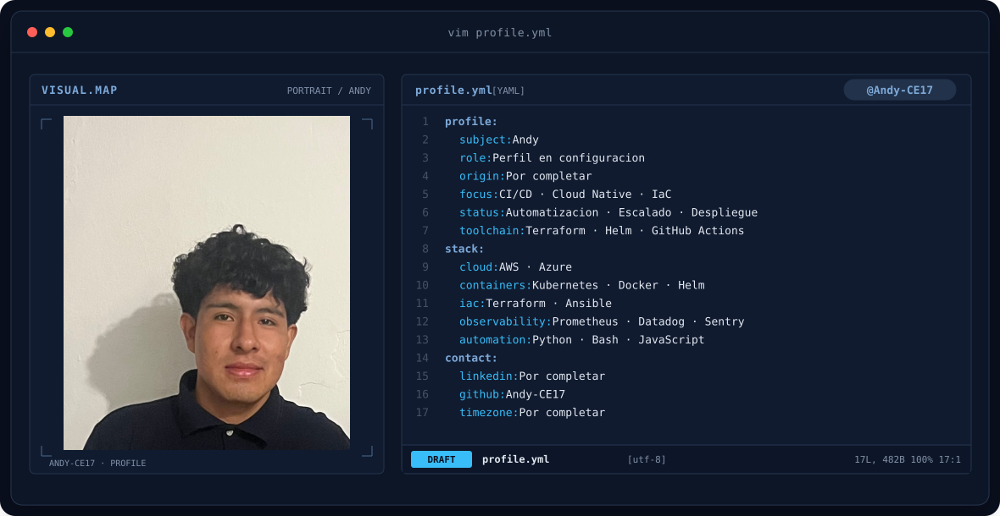

<div align="center">
  
  <br>
  
</div>

<!-- Presentación inicial. Las tecnologías y los enlaces se completarán más adelante. -->

## `$ whoami`

<table>
<tr>
<td width="30%" align="center">

</td>
<td width="70%">

```yaml
profile:
  usuario: Andy-CE17
  nombre: Andy
  especialidad: Por completar
  enfoque: Por completar
  estado: Construyendo mi perfil
```

</td>
</tr>
</table>

---

## `$ cat tech-stack.yaml`

> Próximamente: mis tecnologías y herramientas.

| Área | Tecnologías |
| :--- | :--- |
| Lenguajes | Por completar |
| Frameworks | Por completar |
| Bases de datos | Por completar |
| Herramientas | Por completar |

---

## `$ ls proyectos/`

> Próximamente: una selección de mis proyectos.

---

## `$ cat habilidades.yaml`

> Próximamente: mis áreas de experiencia y aprendizaje.

---

## `$ connect --socials`

<!-- Añadir únicamente los enlaces personales confirmados. -->

[](https://github.com/Andy-CE17)

<div align="center">
<sub><code>profile: building · theme: steel-blue</code></sub>
</div>
